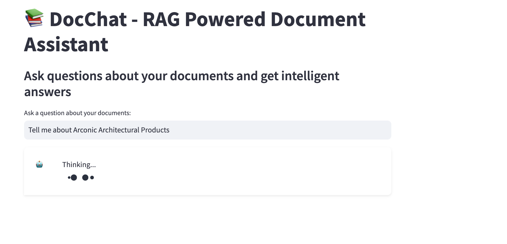
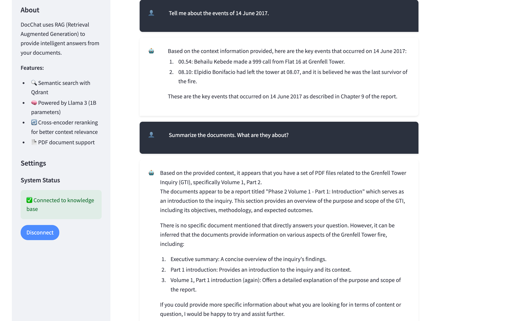

# DocChat - RAG Powered Document Assistant

A beautiful Streamlit application that uses Retrieval Augmented Generation (RAG) to provide intelligent answers from your PDF documents.

## 🌟 Features

- 📂 Splits large PDFs into individual pages for better indexing
- 🔍 Semantic search with Qdrant vector database
- 🧠 Powered by Llama 3 (1B parameters) through Ollama
- 🔄 Cross-encoder reranking for better context relevance
- 💬 Beautiful chat interface with loading animations
- 🎯 Precise document retrieval and answer generation

## 📋 Prerequisites

- Python 3.9+
- Ollama running locally with the llama3.2:1b model installed
- Qdrant running locally on port 6333

## 🚀 Getting Started

### 1. Install Requirements

```bash
pip install -r requirements.txt
```

### 2. Configure Your Environment

Make sure you have:
- Ollama running with `llama3.2:1b` model (`ollama pull llama3.2:1b`)
- Qdrant running on localhost:6333 (you can start it with Docker)

### 3. Split Your PDFs

Place your large PDFs in the `docs-raw` folder, then run:

```bash
python pdfsplitter.py
```

This will split your PDFs into individual pages in the `docs` folder.

### 4. Run the Streamlit App

```bash
streamlit run app.py
```

## 🖥️ Using the App

1. Open your browser and go to http://localhost:8501
2. Click "Connect to Knowledge Base" to connect to your pre-indexed documents
3. Ask questions about your documents in the text input
4. View the AI-generated answers in the chat interface

### 📸 Screenshots

Here are some examples of the Streamlit interface in action:



*Main interface of the DocChat application*



*Example of a query and response in the chat interface*

## 📐 Architecture

The application uses a typical RAG architecture:

1. **Document Processing**: Large PDFs are split into individual pages for better indexing
2. **Embedding**: Documents are embedded using BAAI/bge-large-en-v1.5
3. **Indexing**: Embeddings are stored in Qdrant vector database
4. **Retrieval**: When a query is received, relevant documents are retrieved
5. **Reranking**: Results are reranked using the cross-encoder/ms-marco-MiniLM-L-2-v2 model
6. **Generation**: Llama 3 generates an answer based on the retrieved context

## 📝 Project Structure

```
.
├── docs-raw/                # Original large PDFs
├── docs/                    # Split PDFs (individual pages)
├── imgs/                    # Screenshots of the application
│   ├── img1.png             # Main interface screenshot
│   └── img2.png             # Query example screenshot
├── app.py                   # Streamlit application
├── pdfsplitter.py           # PDF splitting utility
├── notebook.ipynb           # Original RAG implementation notebook
├── requirements.txt         # Python dependencies
└── README.md                # This file
```

## 🔧 Customization

You can customize the application by:

- Changing the LLM model in app.py (replace "llama3.2:1b" with your preferred model)
- Modifying the prompt template to adjust the AI's response style
- Adjusting the similarity_top_k parameter to retrieve more or fewer documents
- Changing the embedding model for different languages or domains